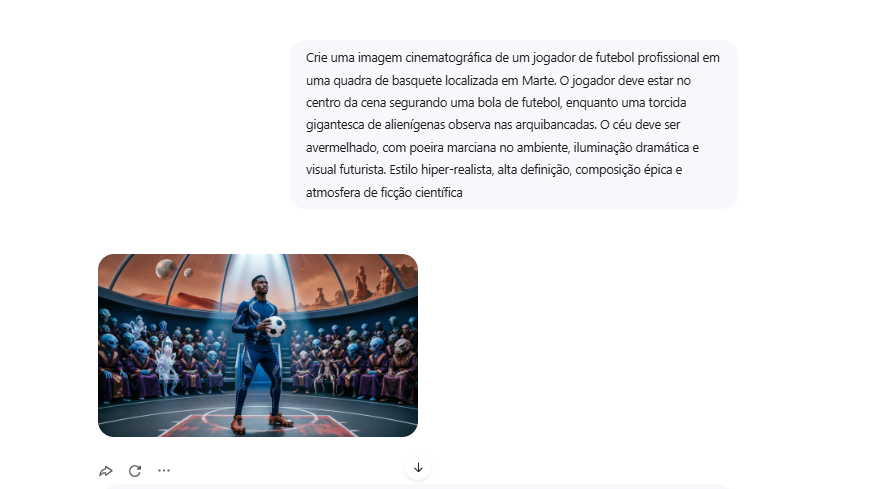
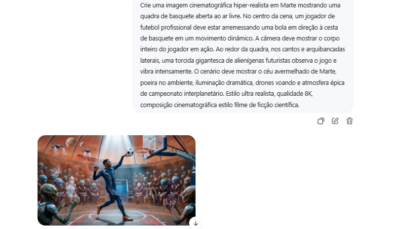
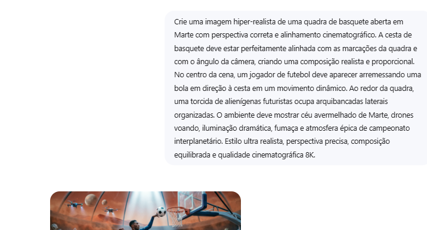
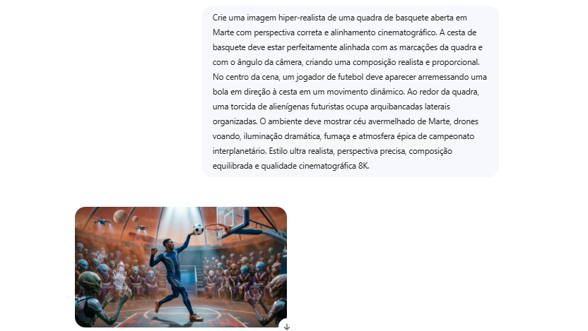

# 🧠 Desafio: A Corrida do Prompt

## 📌 Sobre o Projeto

Este projeto foi desenvolvido para a atividade acadêmica **“A Corrida do Prompt”**, com foco em engenharia de prompts e interação estratégica com Inteligência Artificial.

O objetivo da atividade foi utilizar modelos de IA de forma inteligente e analítica, refinando instruções em até 5 tentativas para alcançar um resultado específico com alta precisão.

---

# 🎯 Objetivo do Desafio

Criar uma imagem cinematográfica utilizando IA contendo:

- Um jogador de futebol
- Em uma quadra de basquete
- Localizada em Marte
- Com torcida de alienígenas
- Estilo hiper-realista
- Atmosfera cinematográfica de ficção científica

O maior desafio foi ajustar:
- composição visual
- alinhamento da quadra
- perspectiva da câmera
- posicionamento da cesta
- organização da torcida
- realismo da cena

Tudo isso respeitando o limite de apenas 5 refinamentos.

---

# 🧩 Metodologia Aplicada

Durante o processo foram utilizados conceitos baseados em:

## 📚 Taxonomia de Bloom

Análise crítica da resposta gerada pela IA:
- identificação de erros
- problemas de perspectiva
- desalinhamento visual
- inconsistências na composição

## 🔗 Taxonomia de Fink

Aplicação do aprendizado adquirido a cada nova tentativa:
- refinamento de palavras-chave
- melhoria de contexto
- especificação técnica mais precisa
- direcionamento cinematográfico

---

# 🖼️ Evolução dos Prompts

---

# 🥇 Tentativa 1

## ✅ Objetivo

Criar a primeira composição geral da cena.

## 📝 Prompt Utilizado

```txt
Crie uma imagem cinematográfica de um jogador de futebol profissional em uma quadra de basquete localizada em Marte. O jogador deve estar no centro da cena segurando uma bola de futebol, enquanto uma torcida gigantesca de alienígenas observa nas arquibancadas. O céu deve ser avermelhado, com poeira marciana no ambiente, iluminação dramática e visual futurista. Estilo hiper-realista, alta definição, composição épica e atmosfera de ficção científica.
```

## 📷 Resultado

<!-- ADICIONE A IMAGEM tentativa1.png NA PASTA assets -->



## 🔍 Análise

A IA conseguiu gerar:
- ambiente marciano
- torcida alienígena
- atmosfera futurista

Porém:
- a quadra não estava aberta
- o jogador estava parado
- não havia ação esportiva dinâmica
- a composição parecia fechada

---

# 🥈 Tentativa 2

## ✅ Objetivo

Transformar a cena em uma quadra aberta com ação dinâmica.

## 📝 Prompt Utilizado

```txt
Crie uma imagem cinematográfica hiper-realista em Marte mostrando uma quadra de basquete aberta ao ar livre. No centro da cena, um jogador de futebol profissional deve estar arremessando uma bola em direção à cesta de basquete em um movimento dinâmico. A câmera deve mostrar o corpo inteiro do jogador em ação. Ao redor da quadra, nos cantos e arquibancadas laterais, uma torcida gigantesca de alienígenas futuristas observa o jogo e vibra intensamente. O cenário deve mostrar o céu avermelhado de Marte, poeira no ambiente, iluminação dramática, drones voando e atmosfera épica de campeonato interplanetário. Estilo ultra realista, qualidade 8K, composição cinematográfica estilo filme de ficção científica.
```

## 📷 Resultado

<!-- ADICIONE A IMAGEM tentativa2.png NA PASTA assets -->



## 🔍 Análise

Melhorias alcançadas:
- jogador em movimento
- quadra aberta
- composição mais cinematográfica
- maior sensação de ação

Problema identificado:
- a cesta e a quadra ficaram desalinhadas
- perspectiva incorreta
- linhas da quadra não acompanhavam o enquadramento

---

# 🥉 Tentativa 3

## ✅ Objetivo

Corrigir perspectiva e alinhamento da composição.

## 📝 Prompt Utilizado

```txt
Crie uma imagem hiper-realista de uma quadra de basquete aberta em Marte com perspectiva correta e alinhamento cinematográfico. A cesta de basquete deve estar perfeitamente alinhada com as marcações da quadra e com o ângulo da câmera, criando uma composição realista e proporcional. No centro da cena, um jogador de futebol deve aparecer arremessando uma bola em direção à cesta em um movimento dinâmico. Ao redor da quadra, uma torcida de alienígenas futuristas ocupa arquibancadas laterais organizadas. O ambiente deve mostrar céu avermelhado de Marte, drones voando, iluminação dramática, fumaça e atmosfera épica de campeonato interplanetário. Estilo ultra realista, perspectiva precisa, composição equilibrada e qualidade cinematográfica 8K.
```

## 📷 Resultado

<!-- ADICIONE A IMAGEM tentativa3.png NA PASTA assets -->



## 🔍 Análise

A composição melhorou:
- alinhamento visual
- distribuição dos elementos
- profundidade da cena

Porém:
- a cesta ainda apresentava inclinação
- a câmera continuava levemente diagonal

---

# 🏅 Tentativa 4

## ✅ Objetivo

Centralizar completamente a câmera e eliminar distorções.

## 📝 Prompt Utilizado

```txt
Refaça a imagem com uma composição frontal e simétrica. A câmera deve estar posicionada exatamente no centro da quadra, de frente para a cesta, como uma foto tirada em linha central. A cesta deve ficar centralizada no fundo da imagem, alinhada com as linhas da quadra e com o círculo central. O jogador deve estar no meio da quadra, arremessando a bola em direção à cesta. A quadra deve ser aberta, em Marte, com céu avermelhado, poeira marciana e arquibancadas laterais cheias de alienígenas nos cantos. Evite ângulo diagonal, evite cesta torta, evite perspectiva lateral. Estilo cinematográfico hiper-realista, alta definição.
```

## 📷 Resultado

<!-- ADICIONE A IMAGEM tentativa4.png NA PASTA assets -->



## 🔍 Análise

A IA respondeu melhor ao direcionamento:
- composição mais centralizada
- câmera frontal
- menos distorção

Ainda assim:
- pequenos desvios na perspectiva permaneceram

---

# 🏆 Tentativa Final

## ✅ Objetivo

Eliminar totalmente a inclinação da quadra e alinhar todos os elementos.

## 📝 Prompt Utilizado

```txt
Quadra de basquete perfeitamente reta vista de frente. A câmera deve estar centralizada no meio da quadra. A cesta deve aparecer reta e centralizada exatamente no eixo da quadra, sem inclinação e sem perspectiva diagonal. As linhas da quadra devem apontar diretamente para a cesta. Um jogador de futebol aparece no centro arremessando a bola. Arquibancadas com alienígenas apenas nas laterais da quadra. Ambiente aberto em Marte, céu vermelho, drones futuristas e iluminação realista. Estilo hiper-realista.
```

## 📷 Resultado Final

<!-- ADICIONE A IMAGEM resultado-final.png NA PASTA assets -->


## ✅ Resultado Obtido

Na última tentativa foi possível:
- alinhar corretamente a cesta
- melhorar a perspectiva frontal
- manter a estética cinematográfica
- preservar o ambiente futurista
- equilibrar os elementos da composição

---

# 📚 Aprendizados Obtidos

Durante a atividade foi possível compreender que:

- pequenas alterações em palavras-chave mudam completamente o resultado
- detalhamento técnico melhora significativamente a IA
- prompts específicos geram resultados mais precisos
- refinamento iterativo é essencial
- engenharia de prompt exige análise crítica e estratégia

---

# 🛠️ Tecnologias Utilizadas

- ChatGPT
- Inteligência Artificial Generativa
- Engenharia de Prompt
- Markdown
- GitHub

---

# 📂 Estrutura do Projeto

```txt
projeto/
│
├── README.md
│
└── assets/
    ├── tentativa1.png
    ├── tentativa2.png
    ├── tentativa3.png
    ├── tentativa4.png
    └── resultado-final.png
```

---

# 👨‍💻 Autor

**Victor Alves Rodrigues Braulino**  
Estudante de Ciência da Computação — UNICID
