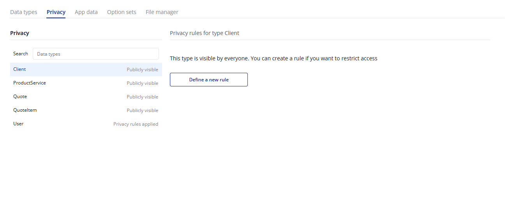
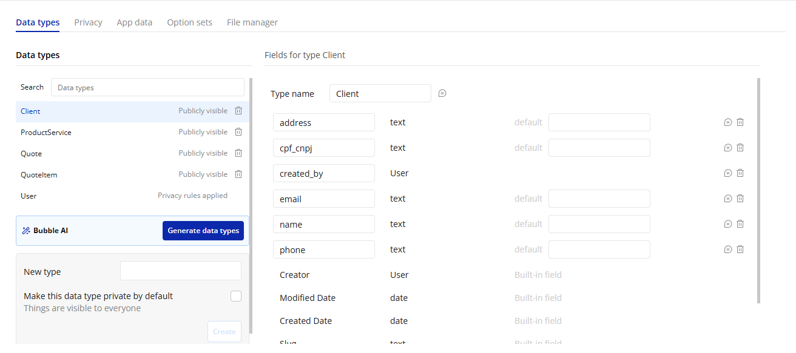

# 🌐 Aplicação Bubble.io

## 📌 Sobre o Projeto

Aplicação web desenvolvida utilizando Bubble.io com foco em automação de processos, gerenciamento de dados e aplicação de boas práticas de engenharia de software utilizando recursos low-code com suporte de Inteligência Artificial.

O sistema foi construído aplicando:
- modelagem de banco de dados
- workflows automatizados
- regras de privacidade
- organização visual
- governança de lógica
- controle de acesso entre usuários

---

# 🔗 Link da Aplicação

Acesse a versão de testes da aplicação:

👉 https://yflashhz.bubbleapps.io/version-test

---

# ⚙️ Funcionalidades Implementadas

- Cadastro de clientes
- Criação de orçamentos
- Gerenciamento de produtos
- Fluxos automatizados
- Controle de status
- Navegação dinâmica
- Segurança de dados
- Regras de privacidade

---

# 🔐 Segurança e Privacidade

Foram implementadas regras de privacidade utilizando o sistema nativo do Bubble.io, garantindo que cada usuário visualize apenas os próprios dados cadastrados.

Exemplo aplicado:
```txt
This Orçamento's Creator is Current User
```

---

# 🛠️ Tecnologias Utilizadas

- Bubble.io
- Workflows
- Option Sets
- Data Privacy Rules
- Low-Code Development
- Inteligência Artificial

---

# 📷 Prints do Sistema

## 🖥️ Dashboard

<!-- ADICIONE AQUI dashboard.png -->


---

## ⚙️ Workflows

<!-- ADICIONE AQUI workflow.png -->


---

## 🔐 Privacy Rules

<!-- ADICIONE AQUI privacy.png -->



---

## 🗄️ Banco de Dados

<!-- ADICIONE AQUI database.png -->



---

# 📚 Aprendizados

Durante o desenvolvimento foi possível compreender:
- funcionamento de plataformas low-code
- importância da segurança de dados
- organização de workflows
- modelagem de banco de dados
- limitações da IA em geração automática de sistemas
- necessidade de revisão humana em aplicações geradas por IA

---

# 👨‍💻 Autor

**Victor Alves Rodrigues Braulino**  
Estudante de Ciência da Computação — UNICID
